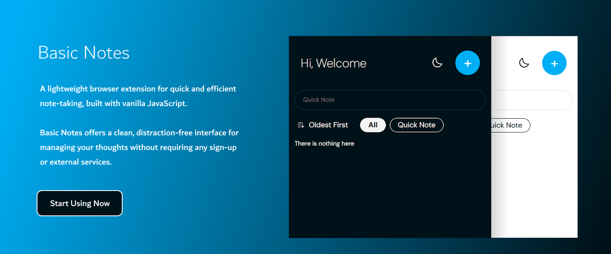
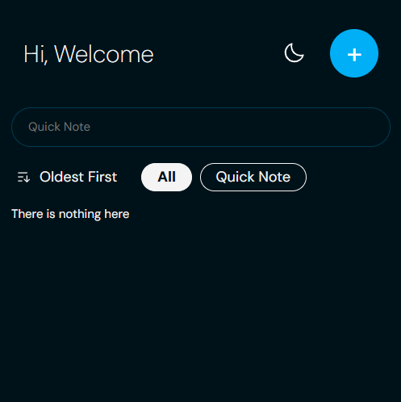
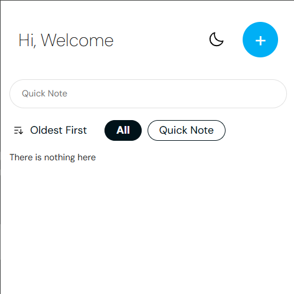

# Basic Notes

A lightweight browser extension for quick and efficient note-taking, built with vanilla JavaScript. Basic Notes offers a clean, distraction-free interface for managing your thoughts without requiring any sign-up or external services.

## Key Features

- 📝 Quick notes with a single keystroke
- 🏷️ Organize notes with customizable tags  
- 🔍 Filter and search notes by tags
- 🌓 Dark/light theme support
- 🔗 Automatic URL detection and link formatting
- ⏱️ Timestamp tracking for creation and updates
- 📱 Responsive and clean interface
- 💾 Local storage for privacy and offline access

## Privacy First

All notes are stored locally in your browser - no external servers, no tracking, and no sign-up required. Your data stays with you.

Perfect for students, developers, or anyone who needs a quick and organized way to jot down notes while browsing.

## Installation

1. Download or clone this repository
2. Open your browser's extension management page:
   - Chrome: Navigate to `chrome://extensions/`
   - Edge: Navigate to `edge://extensions/`
   - Opera: Navigate to `opera://extensions/`
3. Enable "Developer mode"
4. Click "Load unpacked extension"
5. Select the downloaded/cloned folder

### For Firefox

Coming soon to Firefox Add-ons Store.

### For Safari

I don't have a Mac, so I can't test it. If you have one, please let me know if it works.

## Usage

1. Click the extension icon in your browser toolbar
2. Create new notes using the "+" button
3. Add a title and content to your note
4. Optionally add tags to organize your notes
5. Filter notes by tags
6. Toggle between dark/light themes with the theme button
7. Or quickly add a new note and edit it later

## Screenshots

[View Screenshots](#screenshots) | [Installation Guide](#installation) | [Report Bug](https://github.com/doganfurkan/basic-notes/issues)
